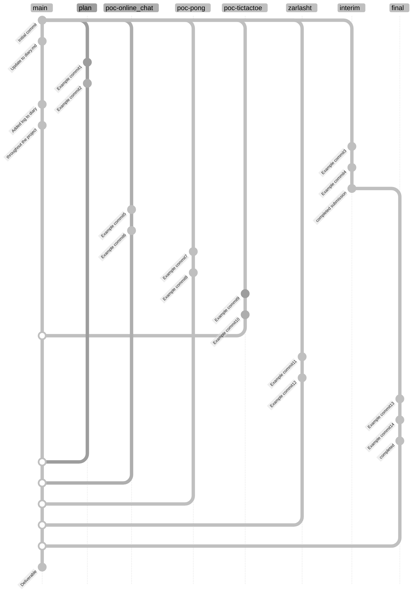

# Final Year Project

Created during the 2024-2025 CS3821 module 'Final Year Project - Full Unit' at
Royal Holloway, University of London.

Project Chosen: &nbsp;A concurrency based game environment<br> Project Title:
&nbsp;&nbsp;TBD

### Repository Structure

Code for different parts of the project, and the different reports produced, are
in their respective folders, worked on in their respective branches.<br><br> See
below, an example of the repository structure (excluding feature-branches,
etc.), and the file structure of the main branch;

<details><summary>Example of repository file structure</summary>
<!-- prettier-ignore-start -->

```
root
├── documents
│   └── ... (code)
├── product
│   ├── proof_of_concepts
│   │   │
│   │   ├── online_chat
│   │   │   └── ... (code)
│   │   │
│   │   ├── tic-tac-toe_(board_game)
│   │   │   └── ... (code)
│   │   │
│   │   └── pong_(game)
│   │       └── ... (code)
│   │
│   └── zarlasht_(final_game)
│       └── ... (code)
│
├── README.md
└── diary.md
```

<!-- prettier-ignore-end -->
</details>

<details><summary>Example git graph for a single deliverable's history</summary>

<br>

Everything is worked on in their respective branches.<br> All products and
documents have their own 'main' branch, as shown below.<br> All of these 'main'
branches will be merged to main to create a deliverable for the markers.



</details>

### Product deployment

Deployment differs for each product produced. Please see the `README.md` files
for their respective folders for details on this.
