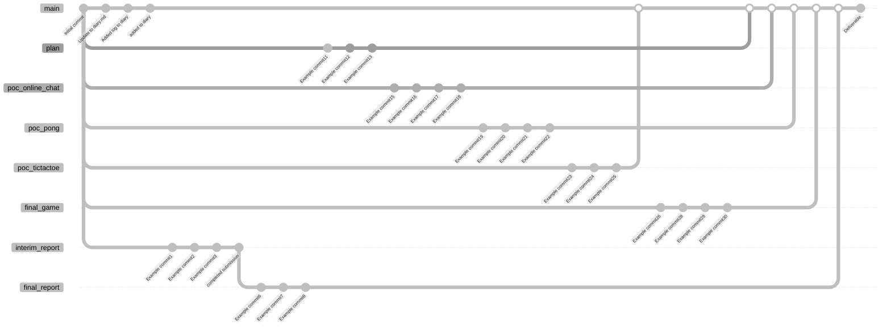

# Final Year Project

Created during the 2024-2025 CS3821 module 'Final Year Project - Full Unit' at Royal Holloway, University of London.

Project Title: A concurrency based game environment

### Repository Structure

Code for different parts of the project, and the different reports produced, are in their respective folders, worked on in their respective branches. See below, an example of the repository structure (excluding feature-branches, etc.), and the file structure of the main branch;

#### Repository structure

Everything is worked on in their respective branches. All of these branches will then be merged to main to create a deliverable.

